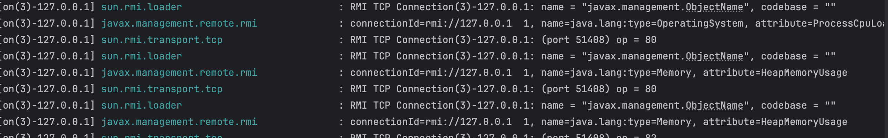

# 使用Vertx作为Spring WebFlux的服务器实现
在了解了Spring WebFlux的工作原理后，决定使用Vertx作为WebFlux的服务器实现。
目前Spring WebFlux支持的服务器有：Tomcat、Jetty、Undertow、Netty，并支持拓展。

[Vertx](https://vertx.io/docs/)是一个异步的、事件驱动的应用程序框架，具有高性能和低延迟的特点，非常适合用于构建高并发的Web应用程序。
# 目前的进展
- [x] 能正常处理请求

# 问题
## ~~服务启动循环打印~~

测试之后现象：使用idea run运行会出现上面的问题，使用debug运行正常打印服务启动信息。
后面测试了一下将服务打成jar包之后通过`java -jar`命令运行，发现没有这个问题......

# 参考文章
- [Spring Boot之Web服务器的启动流程分析](https://itaiit.top/2025/05/13/spring-boot%e4%b9%8bweb%e6%9c%8d%e5%8a%a1%e5%99%a8%e7%9a%84%e5%90%af%e5%8a%a8%e6%b5%81%e7%a8%8b%e5%88%86%e6%9e%90/)
